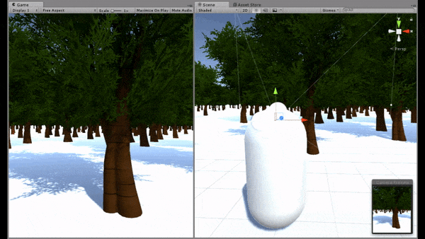

# Create a 3D Character - First Personal Controller


The character controller is the object which is controlled by the player, for example, a basketball player, etc. In general, there are two common types to the character controller, that are first person controller and third person controller.

The first person controller consists of **the camera** and **the capsule** (representative, e.g. cars in racing game or weapons in shooting game). It represents the player's view.


## Create a 3D Capsule

* Create a 3D capsule by clicking `GameObject`, `3D Object`, `Capsule`. Move it to the position where the game starts. Notice set it into the right position (on X,Y,Z axis).
* Add a component `Rigidbody` which is used in physical system (such as gravity).
* Add a camera by draging it to the capsule on the `Hierarchy` View. Set the camera's position (x,y,z) to the initial (0,0,0). Notice the camera's position is **relative** to the capsule one.
* [optional] You can also unselect the `Mesh Renderer` to see where the camera position inside the capsule.


## Create a Controlling Script

* You can create a new folder, named **scripts**, under the Assets directory. And then, create a csharp script, named **CharacterController.cs**, to control the character.
* Add the following content into the script. You can find it on my gists ([https://gist.github.com/jiankaiwang/8f3c0ccbce4c749f55f23489a309db41](https://gist.github.com/jiankaiwang/8f3c0ccbce4c749f55f23489a309db41)).

```c#
/* 
 * author : jiankaiwang
 * description : The script provides you with basic operations of first personal control.
 * platform : Unity
 * date : 2017/12
 */

using System.Collections;
using System.Collections.Generic;
using UnityEngine;

public class CharacterController : MonoBehaviour {

    public float speed = 10.0f;
    private float translation;
    private float straffe;

    // Use this for initialization
    void Start () {
        // turn off the cursor
        Cursor.lockState = CursorLockMode.Locked;		
	}
	
	// Update is called once per frame
	void Update () {
        // Input.GetAxis() is used to get the user's input
        // You can furthor set it on Unity. (Edit, Project Settings, Input)
        translation = Input.GetAxis("Vertical") * speed * Time.deltaTime;
        straffe = Input.GetAxis("Horizontal") * speed * Time.deltaTime;
        transform.Translate(straffe, 0, translation);

        if (Input.GetKeyDown("escape")) {
            // turn on the cursor
            Cursor.lockState = CursorLockMode.None;
        }
    }
}
```

* After you edit the script, you can add the script by dragging it into the capsule on `Hierarchy` view.
* In the `Rigidbody`, select `X` and `Z` on `Freeze Rotation`.


## Create a MouseCamLook Script

* Create a csharp script, named **MouseCamLook.cs**, to control the camera look by mouse moving.
* Add the following content into the script. You can find it on my gists ([https://gist.github.com/jiankaiwang/c83a5f1cdff3c7114c72cc06d98abc95](https://gist.github.com/jiankaiwang/c83a5f1cdff3c7114c72cc06d98abc95)).

```c#
/* 
 * author : jiankaiwang
 * description : The script provides you with basic operations 
 *               of first personal camera look on mouse moving.
 * platform : Unity
 * date : 2017/12
 */

using System.Collections;
using System.Collections.Generic;
using UnityEngine;

public class MouseCamLook : MonoBehaviour {

    [SerializeField]
    public float sensitivity = 5.0f;
    [SerializeField]
    public float smoothing = 2.0f;
    // the chacter is the capsule
    public GameObject character;
    // get the incremental value of mouse moving
    private Vector2 mouseLook;
    // smooth the mouse moving
    private Vector2 smoothV;

	// Use this for initialization
	void Start () {
        character = this.transform.parent.gameObject;
	}
	
	// Update is called once per frame
	void Update () {
        // md is mosue delta
        var md = new Vector2(Input.GetAxisRaw("Mouse X"), Input.GetAxisRaw("Mouse Y"));
        md = Vector2.Scale(md, new Vector2(sensitivity * smoothing, sensitivity * smoothing));
        // the interpolated float result between the two float values
        smoothV.x = Mathf.Lerp(smoothV.x, md.x, 1f / smoothing);
        smoothV.y = Mathf.Lerp(smoothV.y, md.y, 1f / smoothing);
        // incrementally add to the camera look
        mouseLook += smoothV;

        // vector3.right means the x-axis
        transform.localRotation = Quaternion.AngleAxis(-mouseLook.y, Vector3.right);
        character.transform.localRotation = Quaternion.AngleAxis(mouseLook.x, character.transform.up);
    }
}
```

* After you edit the script, you can add the script by dragging it into the camera (under the capsule) on `Hierarchy` view.


## Quick View




